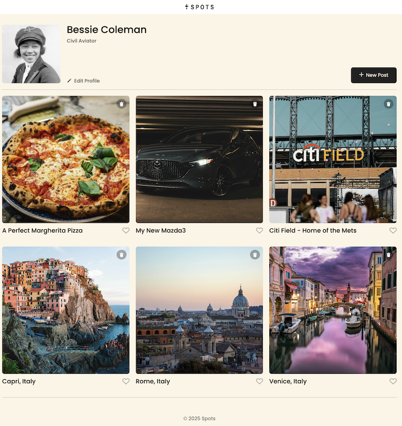

# Spots: A Photo Sharing App

This project is similar in functionality to popular social media photo sharing platforms. The main page is a typical user profile, with an avatar, short bio, and a grid of photographs with titles. You can edit the user's profile, update the user's avatar, add and remove image posts, and use the heart icon to like or unlike posts.

## Technologies Used

- HTML5
- CSS3
- Flexbox and grid layout
- Responsive design
- BEM flat file structure and naming conventions
- Webpack for deployment
- TripleTen API for data storage

## Project Preview

The project can be previewed on Github Pages, located at [https://joepotenza.github.io/se_project_spots](https://joepotenza.github.io/se_project_spots).

- [Initial Walkthrough](https://drive.google.com/file/d/1NdBVA_B2yl2UAbTi0POWMSqeSsJcHNvw/view?usp=sharing)
- [Spots Stage 9: Project Pitch](https://drive.google.com/file/d/1YuHmJxC2MMDLIwL1n07My_i81QhkfVsK/view?usp=drive_link)
- [Spots Final Stage: Project Pitch](https://drive.google.com/file/d/1jJ1xcRIAqvlmREcN0UEwyV6dtxcZe7k4/view?usp=sharing)

## Project Design

The project was designed by TripleTen using Figma. [The detailed design can be found here](https://www.figma.com/file/mXGZ6wZ4QPKx5KjpHX9QCV/Sprint-9-Project%3A-Spots?type=design&node-id=2601-356&mode=design&t=8JYAZ2FrTwE44u6M-0).

## Future Improvements

Planned additions to the project include:

1. User sign-in
2. Uploading photos instead of using external URLs
3. Better error handling rather than just logging to console

