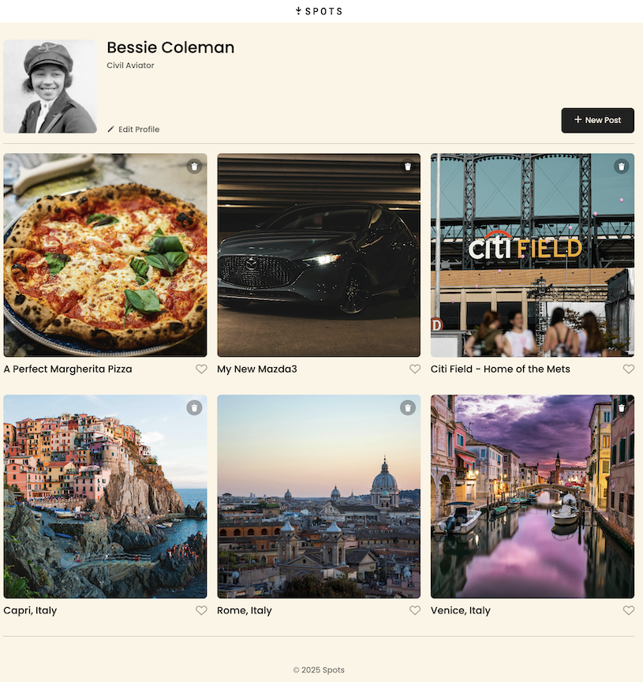

# Spots: A Photo Sharing App

This project is similar in functionality to popular social media photo sharing platforms. The main page is a typical user profile, with an avatar, short bio, and a grid of photographs with titles. There are buttons for editing the bio, adding a new post, and liking the photos.

## Technologies Used

- HTML5
- CSS3
- Flexbox and grid layout
- Responsive design
- BEM flat file structure and naming conventions

## Project Preview

The project can be previewed on Github Pages, located at [https://joepotenza.github.io/se_project_spots](https://joepotenza.github.io/se_project_spots).

[A walkthrough video is available here](https://drive.google.com/file/d/1NdBVA_B2yl2UAbTi0POWMSqeSsJcHNvw/view?usp=sharing).

## Project Design

The project was designed by TripleTen using Figma. [The detailed design can be found here](https://www.figma.com/file/BBNm2bC3lj8QQMHlnqRsga/Sprint-3-Project%3A-Spots?type=design&node-id=0-1&mode=design&t=JiWpEtqxwfvfB7ba-0).

## Future Improvements

Planned additions to the project include:

1. User sign-in
2. Editing photos
3. Add a database so data changes are permanent

